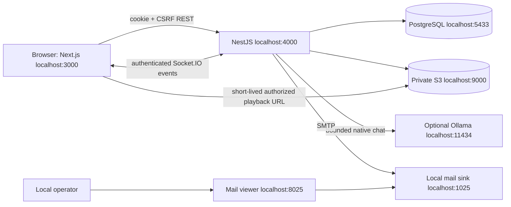
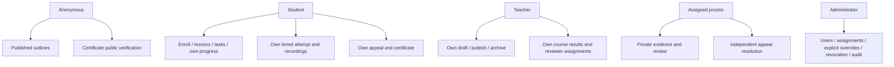
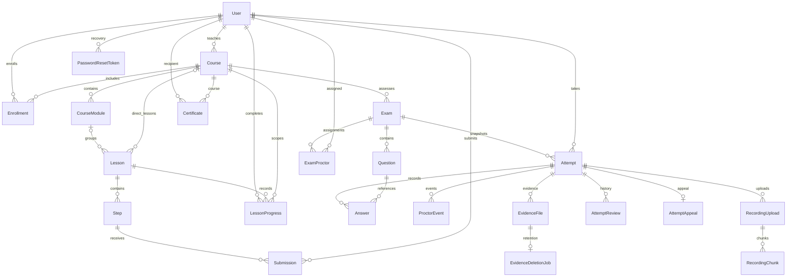
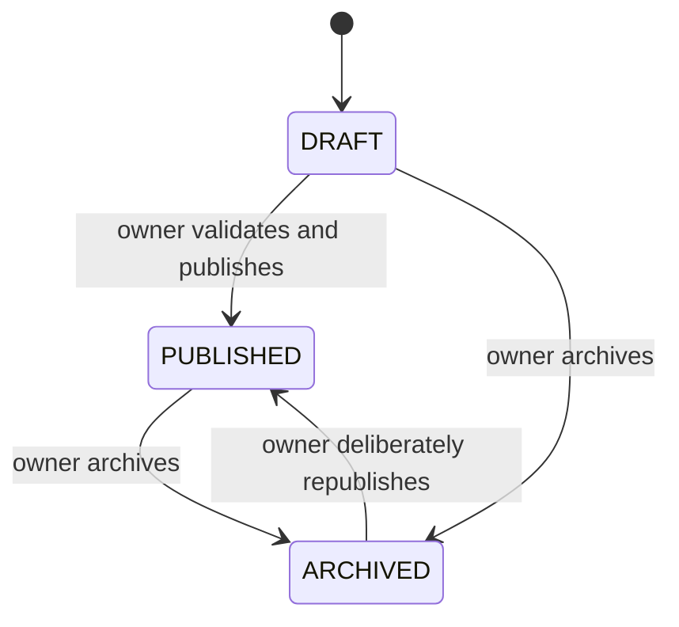
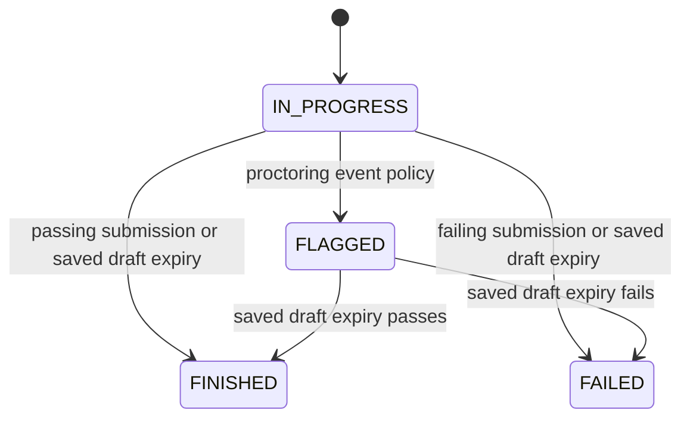

# ProctoLearn: implemented architecture

## Controlled pilot addition — 2026-10-10

Отдельный профиль `.local/pilot` запускает production Next build, Nest API, PostgreSQL и приватный S3 на loopback; `scripts/pilot-proxy.cjs` предоставляет один origin для browser HTTP/API/Socket.IO. Публичный HTTPS режим требует сформированные доверенной ngrok policy gateway-secret/client-IP headers; visitor forwarding headers не являются идентичностью. Маршруты staff/authoring разрешены только в локальном HTTP режиме, backend роли и CSRF сохраняются. Реальное ngrok termination и физический телефон ещё требуют проверки владельцем.

Аддитивная схема: `PilotInvitation` хранит digest, expiry/revocation/redemption и акторов; `PilotMembership` хранит ACTIVE/SUSPENDED и историю приостановки; `PILOT_DEFAULT_COURSE_SEATS` задаёт проверяемую отдельно для каждого курса вместимость, `Enrollment.accessStatus/withdrawnAt` сохраняют прежнюю историю после снятия доступа. Ограничения группы и последнего места проверяются server-side сериализуемыми транзакциями с ограниченными retry. Неистёкший незавершённый экзамен препятствует снятию записи. Optional actor relations используют явный RESTRICT; миграции не удаляют исторические данные.

`ContentImportReceipt` связывает стабильный authoring ID с владельцем, одним course ID и hashes. Узкий authenticated importer создаёт целый DRAFT граф в транзакции; идентичный retry безопасен, изменённый граф вызывает конфликт. Это не механизм parallel draft/live revisions. Итоговые банки остаются в private author profile и базе, не в public manifest/frontend assets. Учебный пакет и реальные проверки описаны в COURSE_QA_REPORT.md; lifecycle и recovery — в PILOT_RUNBOOK.md.

Release work: 2026-10-10, `release/final-demo-20261010`. Exact tested revision and remaining checks are in TEST_RESULTS.md and DEMO_READINESS.md.

## Components and deployment

Next.js 16 App Router provides dark public pages and light authenticated workspaces. NestJS 11 is a modular monolith. PostgreSQL is authoritative for identities, learning, exam snapshots, reviewer decisions and certificate facts. S3-compatible storage holds private evidence; database rows hold references and upload manifests. The release profile uses native PostgreSQL and SeaweedFS because Docker Desktop WSL initialization is unavailable on this laptop.



All native infrastructure binds loopback. No public tunnel/firewall rule is created. Phone access requires an explicitly authorized reachable HTTPS frontend and same-site API configuration. A laptop's localhost QR is not reachable from a phone. Optional inference and external SMTP are not core readiness dependencies. Existing monitoring is optional, disabled in the isolated release profile.

## Roles and use cases



Backend checks ownership/enrollment/assignment on each request. Hiding a UI control is not authorization. Self-review is forbidden; appeals require an independent authorized reviewer. Administrative certificate override is recorded distinctly from an exam-driven certificate and does not fabricate lesson completion.

## Actual data relationships



AuditEvent and UserNotification store actor/target/user identifiers without foreign-key cascade, deliberately preserving operational history. RecordingUpload.evidenceId is a unique scalar reference, not a Prisma relation. Certificate does not have an Attempt foreign key: issuance eligibility is checked from the attempt inside the review transaction. Certificate snapshots freeze recipientName/courseTitle/issuerName and issuedAt/issuedVia/qrCode; database trigger prevents rewriting those facts. A partial unique index permits at most one VALID certificate per user/course. Existing revoked certificates are returned on issuance retries, never automatically reactivated or replaced. Legacy rows without reconstructable issuance facts remain explicitly LEGACY_UNAVAILABLE.

## Assessment to certificate

```mermaid
sequenceDiagram
  participant S as Student browser
  participant A as NestJS
  participant D as PostgreSQL
  participant O as Private S3
  participant P as Assigned proctor
  S->>A: Start attempt (enrollment + prerequisites)
  A->>D: Save immutable exam snapshot
  S->>A: Save draft with expected revision
  A->>D: Compare and update revision
  S->>A: Submit answers
  A->>D: Serializable grade / digest / finish
  S->>A: Upload camera and screen chunks
  A->>O: Persist private bytes
  A->>D: Finalize manifests and evidence
  P->>A: Read assigned evidence; submit decision
  A->>D: Serializable review history + evidence completeness check
  A->>D: If approved and passed, issue immutable certificate
  S->>A: Download own PDF
  A-->>S: Bundled fonts, fixed facts, QR from trusted origin
```

The grading function compares normalized supported answer formats. No LLM marks exams, no unsandboxed submitted code executes. A background worker scans at most 100 persisted open attempts every 15 seconds, using an ID cursor and serializable finalization. It starts after a server restart, includes FLAGGED unfinished attempts, grades only saved drafts and never automatically approves proctor review. At larger backlogs reconciliation can span multiple passes; request paths also enforce the deadline. No external job queue is introduced.

## State transitions



Archive preserves enrolled access. Legacy courses migrate to DRAFT; migrations never publish historical material automatically. Publication is availability, not immutable course versioning: edits affect future learning; each active exam retains its own saved question/rule snapshot.



Review is a separate axis: PENDING → APPROVED or REJECTED. The appeal record is OPEN → terminal decision; immutable AttemptReview rows preserve decision history. Certificate VALID → REVOKED is final. Exact reviewer policies are in RECORDINGS_AND_APPEALS.md.

## Public QR verification

```mermaid
sequenceDiagram
  participant V as Anonymous verifier
  participant W as Next.js /verify/code
  participant A as NestJS
  participant D as PostgreSQL
  V->>W: Open printed URL / scan QR
  W->>A: GET certificates/verify/code (no credentials, no-store)
  A->>D: Select public issuance facts and current status
  A-->>W: Valid facts, revoked, or not found; Cache-Control no-store
  W-->>V: Distinct result, or retryable unavailable on network error
```

No email, phone, recording, score, reviewer identity/reason or internal ownership ID is returned. The page validates the record, not the identity of its presenter. CERTIFICATE_PUBLIC_ORIGIN is a single configured origin independent of CORS order and untrusted request headers; production requires HTTPS.

## API inventory (route families)

| Surface | Main endpoints | Boundary |
|---|---|---|
| Authentication | /auth/csrf, register, login, refresh, logout, me, change-password, forgot-password, reset-password | Signed HttpOnly cookies, CSRF on writes, generic recovery response |
| Courses | GET /courses; /courses/manage; /:id/overview, material, publish, archive | Public published summaries; owner/admin editing; enrolled material |
| Authoring | /courses/:id/modules; /modules/:id/lessons; /lessons/:id/steps; /steps/:id | Owner/admin writes; bounded DTOs and private solutions |
| Learning | /enrollments; lesson complete/check-assignment; step submit/complete; /submissions/.../progress | Own enrollment/progress; server prerequisites |
| Assessment | /courses/:courseId/exams; /attempts/start/:examId; /attempts/:id/draft, submit | Owner authoring; own attempt, revision/digest/deadline |
| Evidence | /evidence/:attemptId/uploads; uploads/:id/chunks/:index, complete, abort | Own upload; assigned reviewer playback; private storage |
| Review | /proctor/sessions/:attemptId/review, appeal, appeal/resolve; /proctor/exams/:examId/assignments | Assignment, independent appeal, no self-review |
| Certificates | /certificates/my, :id/pdf, verify/:code | Owner PDF/list; anonymous minimal verification |
| Operations | /admin/...; /admin/audit; /notifications | Admin management/audit; own notifications |
| AI | POST /ai/chat | Authenticated, own authorized context, server-side active-exam restriction |
| Health | /health, /ready | Liveness vs database/private-storage readiness |

Controllers in backend/src are authoritative for methods and DTOs. New architecture proposals and commercial multi-tenancy are outside this release.

## Critical-operation contracts

Paths below are relative to the API origin (no `/api` prefix). Successful JSON GET/PATCH/PUT responses use 200 and POST responses use Nest's default 201. All writes, including login/register, require an allowed `Origin`, the CSRF nonce cookie and matching `X-CSRF-Token` from `GET /auth/csrf`; invalid origin/token returns 403. Authenticated routes additionally require the signed access cookie (401 when invalid). DTO validation rejects unknown fields and invalid values with 400; throttled routes can return 429. “No body” means the operation takes its input from path/session rather than a body DTO. Tests listed are acceptance coverage references, not a claim that every route was exercised in this documentation pass; actual run results are in TEST_RESULTS.md.

| Method and path | Authentication and ownership | Request DTO / success response | Preconditions and principal failures | Acceptance coverage |
|---|---|---|---|---|
| `GET /auth/csrf`; `POST /auth/register` | Public; CSRF required for registration | GET → `{csrfToken}` + nonce cookie. `RegisterDto`: `name`, `email`, `password`, optional `phone` → `{user}` + access/refresh cookies; tokens are not JSON fields | Password: 6–72 characters, at most 72 UTF-8 bytes, ≥2 digits and ≥2 special characters; optional phone `+7` plus 10 digits. Existing normalized email → 409 | `backend/test/auth-policy.test.cjs`, `auth-cookies.test.cjs`; real register in `integration/ai-core-isolation.cjs` |
| `POST /auth/login`; `GET /auth/me` | Login public with CSRF; me requires access cookie | `LoginDto`: `email,password` → `{user}` + session cookies; me → public user fields | Invalid credentials → 401; public user projection excludes password/refresh digest. Me permits `mustChangePassword` so UI can show reset flow | `backend/test/auth-cookies.test.cjs`, `integration/security.test.cjs`; `frontend/e2e/stage9.cjs` |
| `POST /auth/refresh`; `POST /auth/logout` | CSRF; credentials read from cookies | Refresh DTO is empty; refresh → `{ok:true}` + rotated session cookies. Logout revokes supplied session and clears cookies | Refresh token is single-use; revoked, expired or replayed token → 401; concurrent rejected refresh does not clear a successful rotated cookie | `backend/test/auth-cookies.test.cjs`, `integration/security.test.cjs` |
| `POST /auth/change-password` | Current authenticated user, including required-password-change state | `ChangePasswordDto`: `currentPassword,newPassword` → message; session cookies cleared | Current password must match; new password uses registration policy; token version invalidates existing sessions | `backend/test/auth-policy.test.cjs`, `integration/security.test.cjs` |
| `POST /courses/:id/publish`; `POST /courses/:id/archive` | TEACHER owning course, or ADMIN | No body → updated course with `status` and `publishedAt` | Missing course → 404; other teacher → 403. Publish needs nonblank title/description and ≥1 lesson across direct/module lessons, otherwise 400. Archive preserves enrollment/history; repeat publish preserves original publication date | `backend/test/integration/course-publication.test.cjs`; `frontend/e2e/stage9.cjs` |
| `POST /enrollments/courses/:courseId` | STUDENT; enrollment user comes exclusively from session | No body → `{message,enrollment}` | New enrollment requires PUBLISHED course (403 otherwise); missing → 404. Existing enrollment is returned without duplication, including archived course or completed enrollment | `backend/test/integration/course-publication.test.cjs`, `access.test.cjs` |
| `GET /courses/:id/material` | Enrolled learner, owner TEACHER, or ADMIN | No body → authorized course material; learner projections omit private assignment/task answers | Missing course → 404; unentitled authenticated reader → 403. Existing enrollment permits archived material access | `backend/test/access-courses.test.cjs`, `integration/access.test.cjs`, `integration/course-publication.test.cjs` |
| `GET /attempts/preflight/:examId`; `POST /attempts/start/:examId` | STUDENT enrolled in exam's course | No body. Preflight → readiness information without creating attempt. Start → safe attempt + public exam questions, saved `draft`, `expiresAt,serverTime` | Course completion/tasks required unless explicit admin exam-access grant; incomplete → 403 `COURSE_INCOMPLETE`. Empty exam or limit of 5 attempts → 400. Existing live attempt is reused; rules/questions are snapshotted and hidden answers excluded | `backend/test/integration/attempt-reliability.test.cjs`, `access.test.cjs`; `frontend/e2e/stage9.cjs` |
| `GET /attempts/:id/draft`; `PATCH /attempts/:id/draft` | Authenticated attempt owner; no role-based bypass | GET → `{answers,revision,updatedAt}`. `SaveDraftDto`: `answers:[{questionId,answer}],revision` → same shape with incremented revision | ≤1000 unique question IDs; IDs ≤100 chars, answers 1–10000 chars; integer revision 0–2147483646. Only unfinished IN_PROGRESS before deadline; stale revision → 409 `DRAFT_CONFLICT`; closed → 409 `ATTEMPT_CLOSED`; deadline finalizes saved draft and returns expiry error | `backend/test/integration/attempt-reliability.test.cjs` |
| `POST /attempts/:id/submit` | Authenticated attempt owner | `SubmitAnswersDto`: `answers:[{questionId,answer}]` with same answer bounds → `{attemptId,score,passed,correctCount,totalQuestions,reviewStatus,certificatePending,availableCourses}` | IDs must belong to saved exam. Identical completed submission digest is replay-safe; changed submission → 409 `SUBMISSION_CONFLICT`; late submission grades saved draft, not late answers. Passing alone does not issue certificate | `backend/test/integration/attempt-reliability.test.cjs`, `review-policy.test.cjs`; `frontend/e2e/stage9.cjs` |
| `POST /evidence/:attemptId/uploads` | Authenticated attempt owner | `CreateRecordingUploadDto`: `kind: camera/screen`, UUIDv4 `clientSessionId`, `mimeType` ≤128 chars → upload manifest | Accepted video MIME policy, review/upload window; ≤12 sessions. Same session/kind is idempotent; incompatible MIME → 409 `UPLOAD_CONFLICT`; reviewed/locked → 403; expired → 410 `UPLOAD_EXPIRED` | `backend/test/integration/recording-upload.test.cjs`, `recording-storage.test.cjs` |
| `PUT /evidence/uploads/:id/chunks/:index` | Upload's attempt owner, checked before multipart handling | Multipart field `file`; index 0–8191 → manifest with chunk indices, SHA-256 and sizes; no private storage key | OPEN upload; chunk 1 byte–8 MiB, bounded total bytes. Matching replay accepted; different bytes at same index → 409 `CHUNK_CONFLICT`; quota/size → 413; expired → 410 | `backend/test/integration/recording-upload.test.cjs`, `recording-storage.test.cjs` |
| `POST /evidence/uploads/:id/complete`; `POST /evidence/uploads/:id/abort` | Upload's attempt owner | `CompleteRecordingUploadDto`: integer `expectedChunks` 1–8192, optional boolean `interrupted`; abort has no body → manifest with state/evidenceId | Complete requires contiguous verified chunks; missing → 409 `CHUNKS_MISSING`; active finalize lease → 409 `UPLOAD_FINALIZING`. Repeated identical completion/abort is safe; completed upload cannot be aborted. Review lock and expiry remain enforced | `backend/test/integration/recording-upload.test.cjs`, `recording-storage.test.cjs` |
| `GET /evidence/:attemptId` | Assigned PROCTOR or ADMIN; service checks attempt access | No body → evidence metadata and bounded signed playback URLs for retained files | Nonassigned proctor → 403; missing attempt → 404; underlying storage remains private and pending/deleted evidence is not playable | `backend/test/proctor-access.test.cjs`, `integration/recording-storage.test.cjs`, `integration/evidence-retention.test.cjs` |
| `POST /proctor/sessions/:attemptId/review` | Assigned PROCTOR or ADMIN; cannot review own attempt | `ReviewAttemptDto`: `decision: APPROVED/REJECTED`, trimmed `reason` 3–2000 chars → review fields + `certificatePending:false`, `certificateIssued`, optional certificate ID/status | Must be finished FINISHED/FAILED and initially PENDING. Approval also requires passing saved rules and complete camera/screen evidence; otherwise 409 and whole transaction rolls back. Same decision/reason retry is idempotent; different final decision → 409. Revoked certificate stays revoked | `backend/test/integration/review-policy.test.cjs`, `certificate-release.test.cjs`; `frontend/e2e/stage9.cjs` |
| `POST /proctor/sessions/:attemptId/appeal`; `POST /proctor/sessions/:attemptId/appeal/resolve` | Create: authenticated attempt owner. Resolve: assigned PROCTOR/ADMIN, different from original reviewer and attempt owner | `AppealAttemptDto`: trimmed `reason` 3–2000 chars → appeal. `ResolveAppealDto`: reason + `decision: UPHELD/OVERTURNED` → appeal + review/certificate result | One appeal for finished REJECTED attempt; same request replay-safe; conflicting decision/reason → 409. Overturn approval/issuance and history are transactional; self/original reviewer → 403 | `backend/test/integration/appeal-policy.test.cjs`; `frontend/e2e/stage9.cjs` |
| `POST /admin/users/:userId/grant-exam-access/:courseId`; `POST /admin/users/:userId/grant-certificate/:courseId` | ADMIN only; target must be STUDENT | No body → `{message}` for access, `{message,certificate}` for certificate | Missing user/course → 404; nonstudent → 403. Access upserts explicit exemption; certificate creates immutable issuance facts with ADMIN_OVERRIDE, unless returning existing valid record. Revoked-only history → 409. Neither fabricates lesson/task work; audit/notification included transactionally | `backend/test/admin-admission.test.cjs`, `integration/operations.test.cjs`, `integration/certificate-release.test.cjs` |
| `GET /admin/users/:userId/certificates`; `POST /admin/certificates/:certificateId/revoke` | ADMIN only | List → certificate array. Revoke accepts `reason` body field (not a DTO class), trimmed nonempty string ≤500 chars → `{message,certificate}` | Invalid reason → 409; missing certificate → 404. Repeat revocation preserves first revocation facts; DB trigger forbids reversal or rewriting issuance. Audit written in same transaction | `backend/test/certificate-privacy.test.cjs`, `integration/certificate-release.test.cjs`, `integration/operations.test.cjs` |
| `GET /certificates/my`; `GET /certificates/:id/pdf` | Authenticated owner only; ADMIN does not bypass PDF ownership | Own immutable snapshots/status/verification URL list; PDF → `application/pdf`, attachment, `private,no-store` | Other owner's or absent ID → 404. Bundled fonts and trusted-origin QR; legacy missing facts explicitly marked; revoked PDF marked revoked | `backend/test/integration/certificate-release.test.cjs`; `frontend/e2e/stage9.cjs` |
| `GET /certificates/verify/:code` | Anonymous capability link; no account/ownership fields | 200 `{valid:false}` if unknown; `{valid:false,status}` if revoked; valid → `{valid:true,certificate:{recipientName,courseTitle,issuerName,snapshotStatus,issuedAt,issuedVia}}` | `Cache-Control:no-store`; uses immutable issuance facts, never current mutable user/course names. No email, phone, score, evidence or reviewer details | `backend/test/certificate-privacy.test.cjs`, `integration/certificate-release.test.cjs`; `frontend/e2e/stage9.cjs` |
| `POST /ai/chat` | Authenticated session; each backend tool scopes to current user, enrollment or course ownership | `ChatMessageDto`: nonblank `message` ≤2000 chars; optional `courseId` ≤100; ≤6 `history` items with user/assistant role and nonblank content ≤2000 → `{reply}` | Own unfinished IN_PROGRESS/FLAGGED exam → 403. No answer keys or arbitrary model privileges. Local timeout/provider failure/overload returns explicit unavailable reply, with no cloud fallback; core readiness is independent. RU/KK/model-tool readiness limitations remain documented in AI_CAPABILITIES.md | `backend/test/ai-chat.test.cjs`, `integration/ai-access.test.cjs`; opt-in `integration/ai-local-model.cjs` and `integration/ai-core-isolation.cjs` |

Source contracts: `backend/src/auth/{auth.controller.ts,dto/auth.dto.ts,csrf.service.ts}`, the corresponding courses/enrollments/attempts/evidence/proctor/admin/certificates controllers and services, and `backend/src/ai/ai.dto.ts`. Error `code` fields are provided only where implemented; callers must not infer a code from every localized error message.
